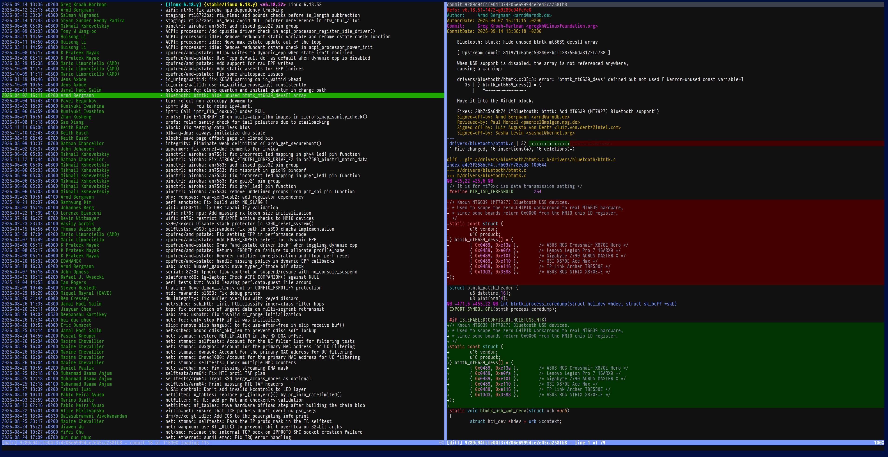

This is an LLM-authored fork of [tig](https://github.com/jonas/tig) but with
vscode-style syntax highlighting powered by a TypeScript backend with
[shiki](https://github.com/shikijs/shiki).

## What is Tig?

Tig is an ncurses-based text-mode interface for git. It functions mainly
as a Git repository browser, but can also assist in staging changes for
commit at chunk level and act as a pager for output from various Git
commands.

## Installation and News

Information on how to build and install Tig are found in
[the installation instructions](INSTALL.adoc).
