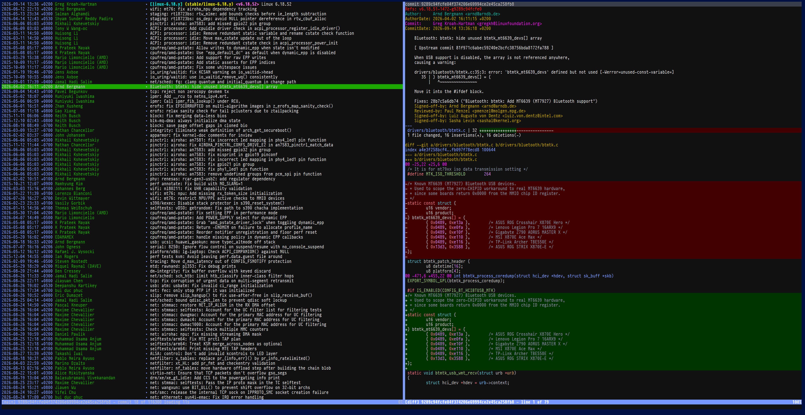

This is an LLM-authored fork of [tig](https://github.com/jonas/tig) but with
vscode-style syntax highlighting powered by a TypeScript backend with
[shiki](https://github.com/shikijs/shiki).



## What is Tig?

Tig is an ncurses-based text-mode interface for git. It functions mainly
as a Git repository browser, but can also assist in staging changes for
commit at chunk level and act as a pager for output from various Git
commands.

## Installation and News

Information on how to build and install Tig are found in
[the installation instructions](INSTALL.adoc).

### With Nix

This repository is a Nix flake (Linux only) whose package includes the
syntax-highlighting filter:

    nix run github:ludios/tig             # try it
    nix profile add github:ludios/tig     # install it

To turn on syntax highlighting, add the settings from
[contrib/tig-syntax.tigrc](contrib/tig-syntax.tigrc) to your tigrc, or
source the copy that the package installs in your profile:

    source ~/.nix-profile/etc/tig-syntax.tigrc

(With `use-xdg-base-directories`, the profile is
`~/.local/state/nix/profile`; a tig config generated by Nix can source
`${pkgs.tig}/etc/tig-syntax.tigrc`.)

On NixOS or with home-manager, add the flake as an input and use its
overlay, which replaces `pkgs.tig` (this needs nixpkgs 26.05 or newer):

```nix
{
  inputs.tig.url = "github:ludios/tig";
  inputs.tig.inputs.nixpkgs.follows = "nixpkgs";
}
```

```nix
nixpkgs.overlays = [ inputs.tig.overlays.default ];
environment.systemPackages = [ pkgs.tig ];  # or home.packages
```

`nix develop` gives a shell with everything needed to build tig, run
`make test`, and work on the filter in `tools/tig-syntax-filter/`.
